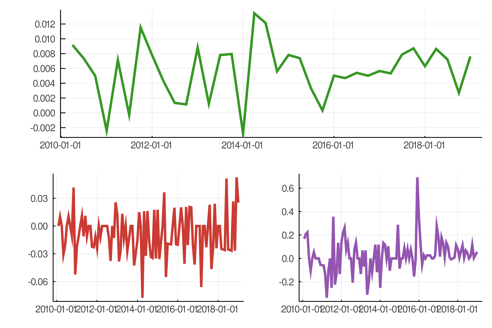
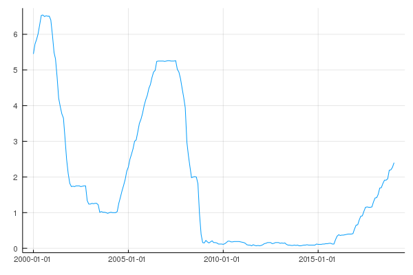

# FredApi.jl



`FredApi.jl` offers the possibility to access the [FRED Developer API](https://research.stlouisfed.org/docs/api/) in Julia.
This package is available in R as [FredApi](https://github.com/markushhh/FredApi).

## Installation

```@julia
add FredApi
```

or

```@julia
add https://github.com/markushhh/FredApi.jl/
```

## Index

The package contains following functions: 

- `set_api_key`
- `get_symbols`
- `search_symbol`
- `get_release`
- `get_metadata`
- `get_category`
- `get_sources`
- `get_source`

## Set up an Envionment Variable for the FRED API key

You can either set up an environment variable for the FRED API key called "API_FRED" or use a local environment variable when entering a new julia session with 

```@julia
set_api_key("YOUR_KEY")
```

where you manually replace `YOUR_KEY` with your private API key. 
To set an environment variable under windows, open command prompt and type in `setx API_FRED "YOUR_KEY"` where `YOUR_KEY` must be replaced with your API key.
To open the command prompt press `Windows+R`, then type in `cmd` and press Enter.
To set an environment variable on an other OS follow [this](https://lmgtfy.com/?qtype=search&t=w&segment=lmgtfy2&is_ad=0&gclid=&q=how+to+set+environment+variable+&as=0&engine=&media_type=) link and add your OS. 
You can request a FRED API key at [https://research.stlouisfed.org/useraccount/login/secure/](https://research.stlouisfed.org/useraccount/login/secure/).

## Tutorial and Workflow

```@julia
using FredApi
set_api_key("API_FRED")
```

Following is an applied tutorial about how to use the package. Simply replace the symbol with your prefered symbol and run the function.

Download a full dataset with

```@julia
get_symbols("GDPC1")
```

output

```@julia
291×1 TimeArray{Float64,1,Date,Array{Float64,1}} 1947-01-01 to 2019-07-01
│            │ Value     │
├────────────┼───────────┤
│ 1947-01-01 │ 2033.061  │
│ 1947-04-01 │ 2027.639  │
│ 1947-07-01 │ 2023.452  │
│ 1947-10-01 │ 2055.103  │
│ 1948-01-01 │ 2086.017  │
│ 1948-04-01 │ 2120.45   │
│ 1948-07-01 │ 2132.598  │
│ 1948-10-01 │ 2134.981  │
│ 1949-01-01 │ 2105.562  │
   ⋮
│ 2017-10-01 │ 18322.464 │
│ 2018-01-01 │ 18438.254 │
│ 2018-04-01 │ 18598.135 │
│ 2018-07-01 │ 18732.72  │
│ 2018-10-01 │ 18783.548 │
│ 2019-01-01 │ 18927.281 │
│ 2019-04-01 │ 19021.86  │
│ 2019-07-01 │ 19121.112 │
```

Download a subsample

```@julia
get_symbols("GDPC1", "2010-01-01", "2019-01-01")
```

output

```@julia
37×1 TimeArray{Float64,1,Date,Array{Float64,1}} 2010-01-01 to 2019-01-01
│            │ Value     │
├────────────┼───────────┤
│ 2010-01-01 │ 15415.145 │
│ 2010-04-01 │ 15557.277 │
│ 2010-07-01 │ 15671.967 │
│ 2010-10-01 │ 15750.625 │
│ 2011-01-01 │ 15712.754 │
│ 2011-04-01 │ 15825.096 │
│ 2011-07-01 │ 15820.7   │
│ 2011-10-01 │ 16004.107 │
│ 2012-01-01 │ 16129.418 │
   ⋮
│ 2017-04-01 │ 18021.048 │
│ 2017-07-01 │ 18163.558 │
│ 2017-10-01 │ 18322.464 │
│ 2018-01-01 │ 18438.254 │
│ 2018-04-01 │ 18598.135 │
│ 2018-07-01 │ 18732.72  │
│ 2018-10-01 │ 18783.548 │
│ 2019-01-01 │ 18927.281 │
```

To change the time frame of the dataset, the `collapse()` function in `TimeSeries.jl` comes in really handy.

```@julia
using TimeSeries

x = get_symbols("FEDFUNDS", "2000-01-01", "2019-01-01")

collapse(x, year, first)
```

output

```@julia
20×1 TimeArray{Float64,1,Date,Array{Float64,1}} 2000-01-01 to 2019-01-01
│            │ Value │
├────────────┼───────┤
│ 2000-01-01 │ 5.45  │
│ 2001-01-01 │ 5.98  │
│ 2002-01-01 │ 1.73  │
│ 2003-01-01 │ 1.24  │
│ 2004-01-01 │ 1.0   │
│ 2005-01-01 │ 2.28  │
│ 2006-01-01 │ 4.29  │
│ 2007-01-01 │ 5.25  │
│ 2008-01-01 │ 3.94  │
   ⋮
│ 2012-01-01 │ 0.08  │
│ 2013-01-01 │ 0.14  │
│ 2014-01-01 │ 0.07  │
│ 2015-01-01 │ 0.11  │
│ 2016-01-01 │ 0.34  │
│ 2017-01-01 │ 0.65  │
│ 2018-01-01 │ 1.41  │
│ 2019-01-01 │ 2.4   │
```

To explore more options, go to [TimeSeries.jl](https://github.com/JuliaStats/TimeSeries.jl/blob/master/docs/src/combine.md)

```@julia
using Plots

plot(x, legend = false)
```



In case you do not know which ID a time series is associated with, you can search for it using the API. Let's have a look over an example. We would like to download the French Gross Domestic Product. We would use `search_symbol` and explore the results.

```@julia
x = search_symbol("GDP", "France")
println(x)
```

The resulting DataFrame is sorted by popularity, you can always sort by any column you'd like by applying `sort!(x, j)` to sort by the `j`-th column.

```
13×3 DataFrame
│ Row │ popularity │ title            │ id                                                                                                │
│     │ Int64      │ String           │ String                                                                                            │
├─────┼────────────┼──────────────────┼───────────────────────────────────────────────────────────────────────────────────────────────────┤
│ 1   │ 47         │ CLVMNACSCAB1GQFR │ Real Gross Domestic Product for France                                                            │
│ 2   │ 24         │ CPMNACSCAB1GQFR  │ Gross Domestic Product for France                                                                 │
│ 3   │ 20         │ NYGDPPCAPKDFRA   │ Constant GDP per capita for France                                                                │
│ 4   │ 16         │ RGDPNAFRA666NRUG │ Real GDP at Constant National Prices for France                                                   │
│ 5   │ 12         │ CLVMNACNSAB1GQFR │ Real Gross Domestic Product for France                                                            │
│ 6   │ 11         │ MKTGDPFRA646NWDB │ Gross Domestic Product for France                                                                 │
│ 7   │ 7          │ NAEXKP01FRQ661S  │ Gross Domestic Product by Expenditure in Constant Prices: Total Gross Domestic Product for France │
│ 8   │ 7          │ CPMNACNSAB1GQFR  │ Gross Domestic Product for France                                                                 │
│ 9   │ 5          │ NAEXKP01FRQ657S  │ Gross Domestic Product by Expenditure in Constant Prices: Total Gross Domestic Product for France │
│ 10  │ 5          │ NAEXKP01FRQ189S  │ Gross Domestic Product by Expenditure in Constant Prices: Total Gross Domestic Product for France │
│ 11  │ 3          │ NAEXKP01FRA189S  │ Gross Domestic Product by Expenditure in Constant Prices: Total Gross Domestic Product for France │
│ 12  │ 2          │ NAEXKP01FRA657S  │ Gross Domestic Product by Expenditure in Constant Prices: Total Gross Domestic Product for France │
│ 13  │ 1          │ NAEXKP01FRA661S  │ Gross Domestic Product by Expenditure in Constant Prices: Total Gross Domestic Product for France │
```

Let's take the most popular series `Real Gross Domestic Product for France` and get more information about it.

```@julia
get_metadata("CLVMNACSCAB1GQFR")
```

output

```
Metadata for: CLVMNACSCAB1GQFR
Title: Real Gross Domestic Product for France
Units: Millions of Chained 2010 Euros
Adjustment: Seasonally Adjusted
Frequency: Quarterly
Notes: Eurostat unit ID: CLV10_MNAC
Eurostat item ID = B1GQ
Eurostat country ID: FR

Seasonally and calendar adjusted data.

For euro area member states, the national currency series are converted into euros using the irrevocably fixed exchange rate. This preserves the same growth rates than for the previous national currency series. Both series coincide for years after accession to the euro area but differ for earlier years due to market exchange rate movements.

Copyright, European Union, http://ec.europa.eu, 1995-2016.Complete terms of use are available at http://ec.europa.eu/geninfo/legal_notices_en.htm#copyright
```

, to get release information about the series, run `get_release("CLVMNACSCAB1GQFR")`

output:

```
Dict{String,Any} with 6 entries:
  "realtime_start" => "2020-01-07"
  "name"           => "National Accounts - GDP (Eurostat)"
  "id"             => 267
  "realtime_end"   => "2020-01-07"
  "link"           => "http://appsso.eurostat.ec.europa.eu/nui/show.do?dataset=…
  "press_release"  => true
```

, to get the category run: `get_category("CLVMNACSCAB1GQFR")`. In this example we get `GDP`.

To get all sources from FRED, run `get_sources()` which results in

```
89×3 DataFrame. Omitted printing of 1 columns
│ Row │ id    │ name                                                    │
│     │ Int64 │ String                                                  │
├─────┼───────┼─────────────────────────────────────────────────────────┤
│ 1   │ 1     │ Board of Governors of the Federal Reserve System (US)   │
│ 2   │ 3     │ Federal Reserve Bank of Philadelphia                    │
│ 3   │ 4     │ Federal Reserve Bank of St. Louis                       │
│ 4   │ 6     │ Federal Financial Institutions Examination Council (US) │
│ 5   │ 11    │ Dow Jones & Company                                     │
│ 6   │ 14    │ University of Michigan                                  │
│ 7   │ 15    │ Council of Economic Advisers (US)                       │
⋮
│ 82  │ 129   │ Moody’s                                                 │
│ 83  │ 133   │ DHI Group, Inc.                                         │
│ 84  │ 135   │ Centers for Disease Control and Prevention     …
```

For more information about a source from FRED, run `get_source(1)` with an Integer specifying the source, e.g.

```@julia
Dict{String,Any} with 5 entries:
  "realtime_start" => "2020-01-07"
  "name"           => "Board of Governors of the Federal Reserve System (US)"
  "id"             => 1
  "realtime_end"   => "2020-01-07"
  "link"           => "http://www.federalreserve.gov/"
```

# Each comment, suggestion or pull request is welcome!
